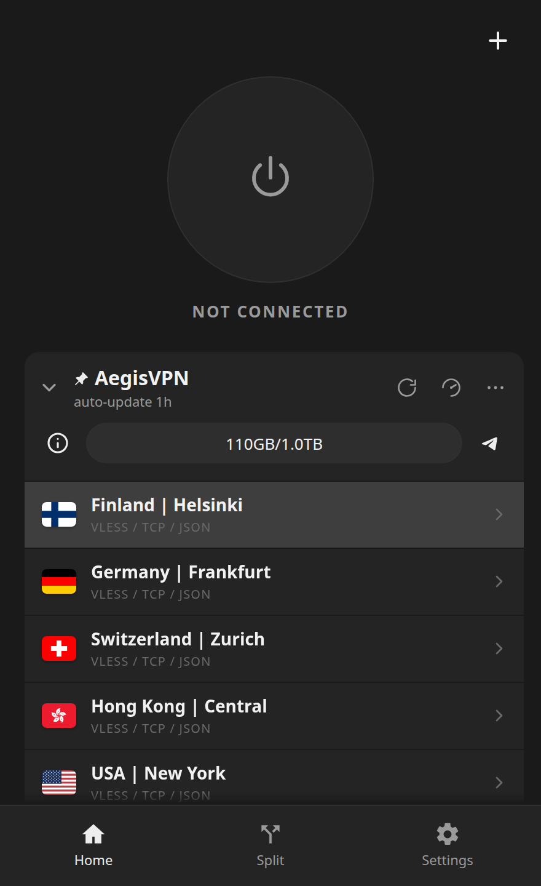
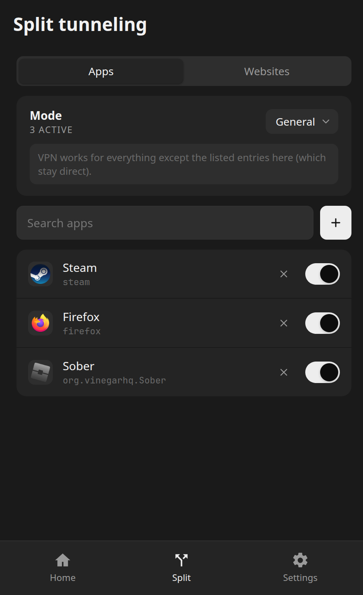
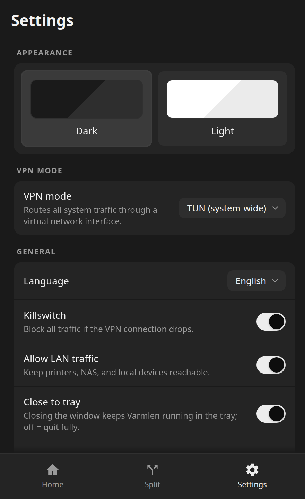

# Varmlen Client Linux

Open-source xray-core VPN client for Linux, with per-app and per-domain split tunneling. Built on Tauri 2 and SvelteKit.

The Android client lives in a separate repo: [Varmlen-Client-Android](https://github.com/demented484/Varmlen-Client-Android). It shares the UI, the subscription parser and the xray config generator.

## Screenshots

<table>
  <tr>
    <th width="33.333%">Home</th>
    <th width="33.333%">Split tunneling</th>
    <th width="33.333%">Settings</th>
  </tr>
  <tr>
    <td></td>
    <td></td>
    <td></td>
  </tr>
</table>

## Features

- Bundles xray-core as the protocol engine (native TUN and routing). Compatible with any xray or v2ray (vless, vmess, trojan, shadowsocks) subscription, a single share-link, several links, or a raw xray/v2ray JSON config.
- Split tunneling that covers TCP and UDP process trees:
  - per-domain rules with wildcards (`*.ru`, `instagram.com`) routed to direct or proxy
  - native games and launchers, Steam/Proton descendants, and Flatpak metadata
  - independent whitelist and blacklist modes for apps and for sites
- Transactional reconnect: the old tunnel is not released until the replacement
  is ready, and the kill switch remains fail-closed on errors.
- DNS interception inside the tunnel without requiring systemd-resolved.
- A root-owned, authenticated networking daemon. The GUI never receives
  capabilities and never executes arbitrary commands as root.
- System tray, autostart, close-to-tray, and crash recovery.

## Install

Grab a release `.deb` or `.rpm` from [Releases](https://github.com/demented484/Varmlen-Client-Linux/releases), or build from source. Opening the package in your distribution's software installer gives the normal graphical authentication prompt.

For a terminal-driven Debian/Ubuntu install without a terminal password prompt:

```bash
pkexec dpkg -i Varmlen_0.3.0_amd64.deb
```

The networking daemon is started on demand through polkit and does not require
systemd. The packaged policy allows the active local desktop user to start the
fixed, root-owned daemon without entering an administrator password after each
reboot; its authenticated socket still accepts only that user's bounded VPN
commands. Installing or removing the package still requires administrator
approval. On minimal installations without polkit, install the fixed components
with `scripts/install-varmlend.sh` as root before starting the client.

The AppImage is temporarily not published: a portable GUI cannot safely provide
the persistent root-owned daemon without a separate one-time installer.

## Build

```bash
npm install
npm run tauri build
```

This produces bundles in `target/release/bundle/`. Use `npm run tauri dev` for a live-reload dev build.

Run the host-safe release checks with:

```bash
cargo test --workspace --locked
cargo clippy --workspace --all-targets --locked -- -D warnings
npm test
npm run check
scripts/test-install-layout.sh
scripts/test-linux-package.sh target/release/bundle/deb/Varmlen_0.3.0_amd64.deb
```

These automated checks do not disconnect the host VPN, modify host routes, or
probe a real public IP. Network transitions are tested through injected
backends and deterministic fixtures.

Requires Rust 1.77+, Node 20+, and the system libraries documented at <https://tauri.app/start/prerequisites/>.

### Wayland and WebKitGTK

The app disables the WebKitGTK DMABUF renderer and falls back to XWayland under Wayland at startup, so it should launch out of the box. If you still hit a blank window, override the backend explicitly:

```bash
GDK_BACKEND=x11 WEBKIT_DISABLE_DMABUF_RENDERER=1 varmlen
```

## License

[GNU GPL v3](./LICENSE). Varmlen bundles [xray-core](https://github.com/XTLS/Xray-core) (Mozilla Public License 2.0) as its protocol engine; see [NOTICE](./NOTICE) for third-party licenses.
